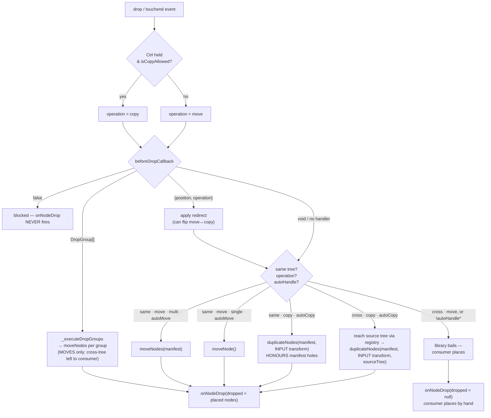
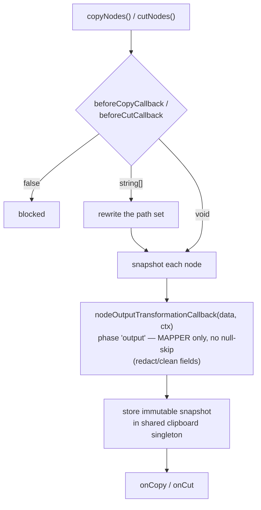
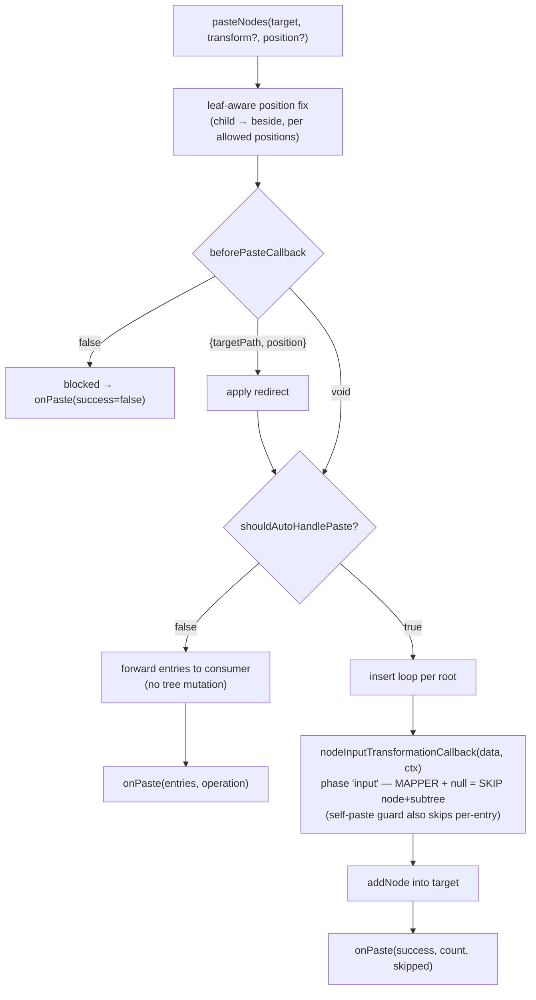
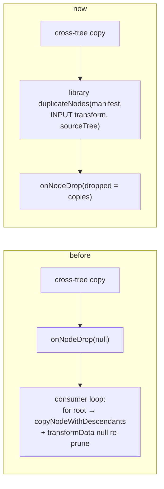

# Placement Pipeline — how gates, events, transforms & primitives stack

**Scope:** the exact order in which drag-drop and clipboard operations run their
interceptors (`before*Callback`), notifications (`on*`), and data transforms, and which
low-level **primitive** actually mutates the tree in each scenario. Deliberately
example-free — this is the library contract, not what any demo happens to wire up.

**Status:** the copy side is now **symmetric with move**. Copy has a batch primitive
(`duplicateNodes`), honours the drag manifest (a pruned node is a hole), and reuses the two
**direction transforms** (`nodeOutputTransformationCallback` / `nodeInputTransformationCallback`)
for both clipboard and drag. Cross-tree copy is auto-handled by the library — the consumer
writes **no** placement loop. §7–§8 record the defect this replaced and the shipped fix.

---

## 1. Two layers

There are two distinct layers, and every confusion comes from conflating them.

| Layer | Members | Have hooks? |
|---|---|---|
| **Operations** (user gestures / entry points) | drag-drop, clipboard copy, clipboard cut, clipboard paste | yes — the `before*Callback` gates + `on*` events |
| **Primitives** (raw verbs that mutate the tree) | `moveNode`, `moveNodes`, `duplicateNodes`, `copyNodeWithDescendants`, `addNode`, `removeNode` | no — bare methods |

The `before*Callback` gates belong to **operations**. Primitives are what an operation
*calls* once its gates pass. When the library can't finish an operation itself (a cross-tree
**move**, or `shouldAutoHandle*=false`), it fires the `on*` **notification** and the consumer
calls a **primitive** by hand — already downstream of every gate.

---

## 2. Two direction transforms

Transforms are defined by **direction, not by operation**. They fire for **both** clipboard
and drag:

- **OUTPUT** (`nodeOutputTransformationCallback`, `(data, ctx) => T`) — a node **leaves** the
  source (egress). Purpose: redact/strip fields that shouldn't travel. Fires: Ctrl+C/X
  snapshot, and the capture side of a copy-drop.
- **INPUT** (`nodeInputTransformationCallback`, `(data, ctx) => T | null`) — a **duplicate
  lands** in a destination (ingress). Purpose: derive fresh ids/names; `null` skips the node
  (and its subtree). Fires: Ctrl+V paste, and the insert side of a copy-drop (same- **or**
  cross-tree).

`ctx.phase` is `'output'` or `'input'`. A **move** fires **neither** — nothing is duplicated.
For a clipboard round-trip the two moments are split in time (copy now, paste later); for a
copy-drop they fire back-to-back in one gesture. Both take the same `NodeTransformContext<T>`
with symmetric `source` / `target` groups.

---

## 3. The cast

| Thing | Kind | Layer | Fires / runs | Can it gate? | null-skip? |
|---|---|---|---|---|---|
| `beforeDragStartCallback` | interceptor | drag op | once, at drag start | **set** (prune/veto/augment) | n/a (returns manifest) |
| `beforeDropCallback` | interceptor | drag op | once, at drop (before placement) | **drop** (block / redirect / route / flip op) | n/a |
| `onNodeDrop` | notification | drag op | after placement (or after bail) | no (fire-and-forget) | n/a |
| `beforeCopyCallback` / `beforeCutCallback` | interceptor | clipboard op | at copy/cut, before snapshot | **set** (rewrite/block) | n/a |
| `nodeOutputTransformationCallback` | transform | egress | per node, as it **leaves** the source | no (mapper) | **no** (`=> T`) |
| `beforePasteCallback` | interceptor | clipboard op | at paste, before insert loop | **batch policy** (redirect/block) | n/a |
| `nodeInputTransformationCallback` | transform | ingress | per node, as a duplicate **lands** | no (the manifest gates) | **yes** (`=> T \| null`) |
| `shouldAutoHandleMove/Copy/Paste` | flags (default **true**) | op | decide whether the library places, or bails to the consumer | — | — |

The **set** decision (which nodes travel) lives in `beforeDragStartCallback` / `beforeCopy` —
not in a transform. `nodeInputTransformationCallback`'s `null` is a pure mapper escape hatch
("map this to nothing"), no longer the *only* way to omit a node from a copy.

---

## 4. Drag-drop drop pipeline

Triggered by the native **`drop`** `DragEvent` (desktop) or **`touchend`** (touch). Both
funnel into `_handleDrop`. `beforeDropCallback` does **not** rewrite `dragged` — the set was
fixed by `beforeDragStartCallback` at drag start — but it **can flip `operation`** (e.g. force
a cross-tree drop to `copy`).

Key facts encoded above:

- `false` from `beforeDropCallback` suppresses `onNodeDrop` entirely.
- `DropGroup[]` routing auto-executes **moves only** (`_executeDropGroups` → `moveNodes`).
- **Copy — same-tree AND cross-tree — is auto-placed** via `duplicateNodes`, honouring the
  drag manifest (`_dragSetOverride`) so a pruned descendant is a hole (not copied). The
  per-node transform is `nodeInputTransformationCallback` (else a default id-uniquifier).
- Cross-tree copy reaches the source tree through the **clipboard registry**; the source's
  placement manifest is published both on the module-level `dragSet` **and** in the drop
  `dataTransfer` (`application/svelte-treeview-manifest`), because the source's `dragend`
  (which clears the module set) can fire **before** the target's `drop` under synthetic DnD.
- Only a cross-tree **move** (or any `shouldAutoHandle*=false`) still bails to
  `onNodeDrop(dropped=null)` for the consumer.

---

## 5. Clipboard copy / cut pipeline

> `copyNodes` here is the **clipboard** "copy to clipboard" op — distinct from the
> `duplicateNodes` **primitive** (copy-to-a-place). The set is gated by `beforeCopy/Cut` (a
> real set gate), then each node is mapped by the **output** transform before entering the
> immutable singleton.

---

## 6. Clipboard paste pipeline

Paste and the copy-drop share the **input** transform: both are "a duplicate is being
inserted here." A batch gate (`beforePasteCallback`), a per-node input transform with
null-skip, and an auto-handle flag.

---

## 7. Scenario matrix — who places, which primitive, which transform

| Operation | Same-tree | Cross-tree |
|---|---|---|
| **move** | library — `moveNode` (single) / `moveNodes` (multi), **honours manifest** | library **bails** → `onNodeDrop(null)`; consumer places |
| **copy** | library — `duplicateNodes`, **honours manifest**, INPUT transform | library — `duplicateNodes(sourceTree)`, **honours manifest**, INPUT transform (auto — no consumer loop) |
| **clipboard copy→paste** | full pipeline: `beforeCopy` → OUTPUT transform → `beforePaste` → INPUT transform (null-skip) | same pipeline; cross-tree source auto-removes on cut via the clipboard registry |

Transform availability — copy now matches move + paste:

| Path | Set gate | Batch gate | Per-node transform | Manifest honoured |
|---|---|---|---|---|
| drag move | `beforeDragStart` | `beforeDrop` | — (move keeps ids) | ✅ |
| drag copy (same-tree) | `beforeDragStart` | `beforeDrop` | `nodeInputTransformationCallback` (INPUT) | ✅ |
| drag copy (cross-tree) | `beforeDragStart` | `beforeDrop` | `nodeInputTransformationCallback` (INPUT) | ✅ |
| clipboard paste | `beforeCopy` | `beforePaste` | `nodeInputTransformationCallback` (INPUT) | ✅ (per-entry) |

---

## 8. How the symmetry was reached (was §7–§8's defect)

**Before:** move was served at every layer; copy at almost none — no batch primitive, the drag
manifest ignored on copy, a hard-coded id transform, and `transformData → null` abused as a
per-node gate. To leave a pruned descendant behind on a copy the consumer had to re-encode a
decision the manifest already made, writing a placement loop the move side never needed.

**The fix (shipped):**

1. **`duplicateNodes(paths, target, position, transform?, sourceTree?)`** — the copy twin of
   `moveNodes`. Honours the manifest (a node absent from the set is a hole → **not** copied,
   the copy equivalent of move's leave-behind), resolves the set up front, chains roots in
   source order. `sourceTree` lets it copy another tree's live nodes cross-tree. (Named
   `duplicateNodes`, not `copyNodes` — the latter is the clipboard op.)
2. **Two direction transforms** replace the old copy/paste-specific pair. Drag-copy reuses the
   **input** transform (its insert moment *is* the paste moment), so id derivation is
   declarative and shared, not hard-coded.
3. **`shouldAutoHandleCopy` honoured cross-tree.** With the input transform minting ids and the
   source tree reachable via the registry, the library runs `duplicateNodes` into the target
   itself and fires `onNodeDrop(dropped=copies)`. The consumer writes no loop.
4. **The manifest is the set decision — for copy too.** `null` from the input transform stays a
   pure mapper escape hatch ("map to nothing"), no longer the only way to omit a node.

End state — one mental model for both verbs:

| | gate the set | batch primitive | per-node transform | manifest = holes |
|---|---|---|---|---|
| **move** | `beforeDragStart` | `moveNodes` | — | ✅ |
| **copy** | `beforeDragStart` | **`duplicateNodes`** | `nodeInputTransformationCallback` (INPUT) | ✅ |

The guard/leave-behind behaviour is now expressed entirely by `beforeDragStartCallback` (prune
the set) + a registered input transform (mint ids) — the drop handler is a notification, not a
placement loop. Guarded by `e2e/drag-drop.spec.ts` ("duplicateNodes", "cross-tree AUTO-copy")
over fixtures `section-duplicate-nodes` and `section-xtree-copy`.
